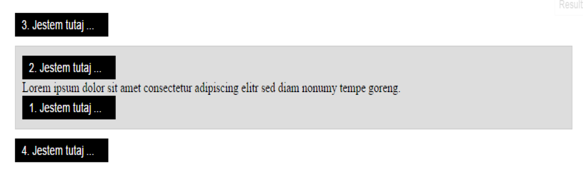

#  jQuery - modifying elements

> Complete the exercises in appropriate files.

Complete the exercises in `app.js` unless the exercise description says otherwise.
Remember to separate exercises with comments, and write legible, well-formatted code.   

**Do not modify the HTML code unless the instructions say otherwise.**

**IMPORTANT - do not change the file structure or filenames and use the prepared variables**

#### Exercise 1 - done with the lecturer

In`index.html`, find an element with ```people``` **class**.  
Create an appropriate function and place a ```click``` event on the ```add``` button within the function.
When clicked, do the following:
1. Save the value from the field with ```addUser``` **id** in a variable.
2. Save the value from the field with ```age``` **id** in a variable.
3. Insert a new element at the end of the list, set the age of this person as the ```data``` attribute.
4. Each time an element is inserted, call a different function that will set color in **li** elements in the following way:
   * green for people `15` years old or younger,
   * blue for people between `16` and `40` years old,
   * brown for people `41` or more years old.

-------------------------------------------------------------------------------

#### Exercise 2

1. In `index.html`, find an element with ```where-i-am``` **class**.  
2. Find a `div` in the element from point 1.
3. Next, create a function and create **span** elements within it, adding them in the right places - as shown in the image below.
4. Substitute the three dots with the name of the function that you are using, e.g. ```I am here append```.
   Do not change the HTML code.


